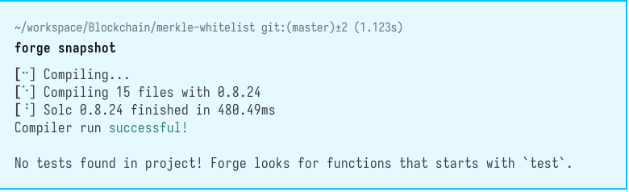

# Decentralized NFT Access Manager (DNAM)


## Overview

The Decentralized NFT Access Manager (DNAM) is a Solidity-based smart contract system designed to manage access to NFT launches, pre-sales, or any other exclusive content in a decentralized, secure, and efficient manner using Merkle Trees for whitelisting.

The system provides NFT builders with a tool to create an exclusive experience for their early supporters or any designated group, ensuring that only whitelisted addresses can mint or purchase NFTs during the early stages of a launch.



## Key Features

1. **Merkle Tree Whitelisting**: Utilize Merkle Trees to efficiently verify whether an address is part of the whitelist without revealing the entire list on-chain, thus ensuring privacy and reducing gas costs.

2. **Dynamic Whitelist Management**: Enable NFT project owners to dynamically update the whitelist by deploying a new Merkle Tree root to the smart contract, catering for last-minute changes or additional rounds of whitelisting.

3. **OG Supporter Rewards**: Implement a system that allows for different tiers within the whitelist, such as OG supporters, who may receive additional benefits like reduced minting costs, access to special editions, or higher purchase limits.

4. **Decentralized Verification**: Allow users to verify their whitelisting status through a decentralized interface, providing transparency and trust in the whitelisting process.

5. **Go Client**: A comprehensive Go client for interacting with the smart contract, including whitelist management, verification, and minting operations.

## Project Structure

```
merkle-whitelist/
├── cmd/                          # Command applications
│   └── ogclient/                 # OG whitelist client application
│       └── main.go               # Entry point for the client
├── internal/                     # Private application code
│   ├── merkletree/               # Merkle tree implementation
│   │   ├── merkletree.go         # Core merkle tree functionality
│   │   └── merkletree_test.go    # Tests for merkle tree
│   └── config/                   # Configuration handling
│       └── config.go             # Application config
├── pkg/                          # Public libraries
│   ├── contracts/                # Smart contract bindings
│   │   └── ogwhitelist/          # OG whitelist contract
│   │       ├── ogwhitelist.go    # Generated contract binding
│   │       └── ogwhitelist_test.go # Tests for contract interactions
│   └── ethereum/                 # Ethereum utilities
│       ├── client.go             # Ethereum client wrapper
│       ├── client_test.go        # Tests for client
│       └── types.go              # Common Ethereum types
├── scripts/                      # Scripts for dev/deployment
│   └── generate_bindings.sh      # Script to generate Go bindings
├── contracts/                    # Solidity contracts
│   └── OGWhitelist.sol           # The whitelist contract
├── testdata/                     # Test fixtures
│   └── addresses.json            # Test addresses for whitelist
├── go.mod                        # Go modules file
├── go.sum                        # Go dependencies checksum
└── README.md
```